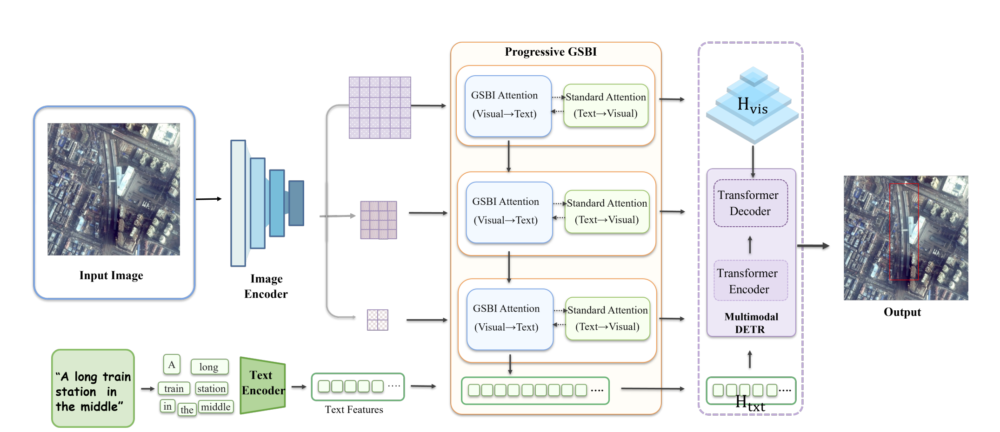
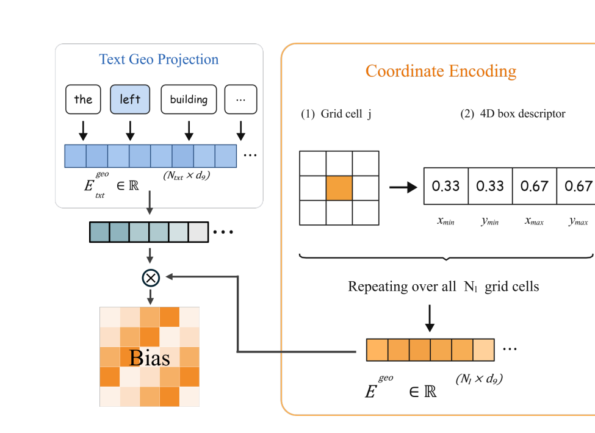

<div align="center">

# GADAN  

### Text-Conditioned Coordinate Bias for Remote Sensing Visual Grounding

[](https://www.python.org/)[](https://pytorch.org/)[](#overview)[](#geometry-aware-spatial-bias-injection)[](LICENSE)

[Method](#method)    [Results](#results)    [Installation](#installation)    [Data](#data-preparation)    [Training](#training)    [Evaluation](#evaluation)

**Official PyTorch implementation of _GADAN: Text-Conditioned Coordinate Bias for Remote Sensing Visual Grounding_.**

</div>

---

## 💡 Overview

> **TL;DR:** GADAN introduces **Geometry-Aware Spatial Bias Injection (GSBI)**,
> a lightweight module that explicitly connects contextual language tokens with
> normalized visual coordinates. GSBI adds a text-conditioned, low-rank
> coordinate bias to pre-softmax cross-attention logits through zero-initialized,
> input-adaptive per-head coefficients.

Remote sensing visual grounding (RSVG) must identify one referred object from a
dense aerial scene using a short natural-language expression. Standard
cross-modal attention primarily models content compatibility and leaves the
relationship between language tokens and image coordinates implicit.

GADAN makes that relationship explicit. It progressively refines linguistic
features across four visual scales, combines GSBI with a compact BiLSTM text
encoder, and predicts the referred bounding box with a Deformable DETR-style
decoder.

### ✨ Highlights

- **Explicit text-coordinate compatibility:** contextual text tokens and
  normalized grid boxes are projected into a shared low-rank space.
- **Safe residual initialization:** the geometry pathway is controlled by
  zero-initialized per-head coefficients, so GSBI starts as standard
  cross-attention.
- **Input-adaptive geometry:** each attention head modulates its coordinate bias
  according to the current image-expression pair.
- **Progressive multi-scale fusion:** a shared GSBI module updates the text stream
  from fine to coarse visual feature levels.
- **No auxiliary geometric supervision:** the coordinate pathway is trained only
  through the standard grounding objective.

<a id="method"></a>

## 🧠 Method

<p align="center">
  
</p>

<p align="center">
  <sub>
    GADAN performs progressive bidirectional fusion over multi-scale visual
    features and uses a Deformable DETR-style decoder for target localization.
  </sub>
</p>

### Geometry-Aware Spatial Bias Injection

For each visual level, GSBI represents every grid cell with a normalized box
`[xmin, ymin, xmax, ymax]`. Contextual text features and these box descriptors
are projected into a shared geometry space to form a text-conditioned
coordinate compatibility matrix.

The resulting bias is added to the semantic attention logits:

```text
attention logits = semantic logits + adaptive coefficient × coordinate bias
```

The effective coefficient factorizes into a learnable per-head base coefficient
and an instance-dependent gate. Because the base coefficient is initialized to
zero, the module is exactly equivalent to standard dot-product cross-attention
at initialization.

<p align="center">
  
</p>

<p align="center">
  <sub>
    GSBI forms a compact compatibility matrix between contextual text tokens
    and normalized visual grid coordinates before injecting it into attention.
  </sub>
</p>
<a id="results"></a>

## 📊 Results

### Main results

The paper reports the following test-set results. All values are percentages;
higher is better.

| Dataset | Pr@0.5 | Pr@0.6 | Pr@0.7 | Pr@0.8 | Pr@0.9 | mIoU | cIoU |
|:--|--:|--:|--:|--:|--:|--:|--:|
| DIOR-RSVG | **83.90** | **81.87** | **76.91** | **66.23** | **45.44** | **75.11** | **82.93** |
| OPT-RSVG | **82.12** | **79.59** | **73.07** | **57.83** | 24.96 | **70.24** | **78.12** |

On DIOR-RSVG, GADAN improves over the directly comparable LQVG system by
**2.41 mIoU points**. On OPT-RSVG, it improves over LQVG by **2.99 mIoU** and
**2.53 cIoU points**. The OPT-RSVG gain does not extend to Pr@0.9, where GADAN
is 1.87 points below LQVG.

### Controlled fusion and text-encoder comparison

| Fusion | Text encoder | Pr@0.5 | Pr@0.7 | Pr@0.9 | mIoU | cIoU |
|:--|:--|--:|--:|--:|--:|--:|
| LQVG | RoBERTa-base | 81.81 | 74.31 | 40.85 | 72.70 | 80.90 |
| LQVG | BiLSTM | 82.13 | 74.21 | 41.31 | 72.82 | 81.32 |
| GSBI | RoBERTa-base | 83.71 | 76.68 | 43.99 | 74.39 | 82.63 |
| GSBI | **BiLSTM** | **83.90** | **76.91** | **45.44** | **75.11** | **82.93** |
| GSBI | BERT-tiny | 83.11 | 75.96 | 43.43 | 73.98 | 82.48 |
| GSBI | RoBERTa-base (frozen) | 82.88 | 76.17 | 44.03 | 73.96 | 82.50 |

With the text encoder held fixed, GSBI improves mIoU by **2.29 points with
BiLSTM** and **1.69 points with RoBERTa-base**, separating the effect of
coordinate-conditioned fusion from the choice of language encoder.

### Spatial-language diagnostics

GADAN improves mIoU and Pr@0.7 on 11 of 13 directional keyword subsets in the
DIOR-RSVG analysis. The largest improvements occur for `above` and `below`.
Performance decreases for `middle` and slightly for `bottom`, highlighting the
difference between absolute image coordinates and ordinal or object-relative
relations.

> [!NOTE]
> The source package does not include a pretrained GADAN checkpoint. The tables
> above reproduce the values reported in the accompanying paper; they are not
> claimed as results rerun from the released archive.

## 🛠️ Installation

The original experiments used **Python 3.7**, **PyTorch 1.8.1**,
**torchvision 0.9.1**, and **CUDA 11.1**.

```bash
conda create -n gadan python=3.7 -y
conda activate gadan

conda install pytorch==1.8.1 torchvision==0.9.1 \
  torchaudio==0.8.1 cudatoolkit=11.1 -c pytorch -c conda-forge

pip install -r requirements.txt
```

Compile the custom multi-scale deformable-attention operator:

```bash
cd models/ops
bash make.sh
python test.py
cd ../..
```

> [!IMPORTANT]
> The CUDA extension must be compiled with a toolchain compatible with the
> installed PyTorch and CUDA versions. Run `models/ops/test.py` before training.

## 📦 Data preparation

GADAN supports the XML-based directory structure used by
[DIOR-RSVG](https://github.com/ZhanYang-nwpu/RSVG-pytorch) and
[OPT-RSVG](https://github.com/like413/OPT-RSVG). Download each dataset from its
official source and arrange it as follows:

```text
data/
├── DIOR_RSVG/
│   ├── JPEGImages/
│   ├── Annotations/
│   ├── train.txt
│   ├── val.txt
│   └── test.txt
└── OPT_RSVG/
    ├── JPEGImages/
    ├── Annotations/
    ├── train.txt
    ├── val.txt
    └── test.txt
```

Pass the dataset root through `RSVG_PATH` or `--rsvg_path`. Dataset files are
not redistributed by this repository; follow the licenses and terms of the
original dataset providers.

## 🚀 Training

The default launcher trains the paper's **BiLSTM + GSBI** configuration on four
GPUs:

```bash
RSVG_PATH=/path/to/DIOR_RSVG \
OUTPUT_DIR=outputs/gadan_bilstm_gsbi \
bash scripts/train.sh
```

Common environment overrides:

```bash
CUDA_VISIBLE_DEVICES=0,1,2,3 \
NPROC_PER_NODE=4 \
TOKENIZER_PATH=/path/to/roberta-tokenizer \
RSVG_PATH=/path/to/DIOR_RSVG \
OUTPUT_DIR=outputs/gadan_bilstm_gsbi \
bash scripts/train.sh --batch_size 1 --num_workers 4
```

Although the final model uses a randomly initialized BiLSTM encoder, it uses a
RoBERTa tokenizer vocabulary by default. Set `TOKENIZER_PATH` to a local
tokenizer directory for offline training.

### Paper configuration

| Setting | Value |
|:--|:--|
| Input size | 640 × 640 |
| Optimizer | AdamW |
| Epochs | 70 |
| Transformer learning rate | 1e-4 |
| Visual-backbone learning rate | 5e-5 |
| Text-encoder learning rate | 1e-5 |
| Weight decay | 5e-4 |
| LR schedule | ×0.1 at epoch 60 |
| Hidden dimension | 256 |
| Geometry dimension | 64 |
| Attention heads | 8 |
| Visual feature levels | 4 |
| Decoder layers | 4 |

## 🔍 Evaluation

Evaluate IoU-based grounding metrics:

```bash
CHECKPOINT=/path/to/checkpoint.pth \
RSVG_PATH=/path/to/DIOR_RSVG \
bash scripts/evaluate.sh
```

Evaluate AP and IoU metrics:

```bash
CHECKPOINT=/path/to/checkpoint.pth \
RSVG_PATH=/path/to/DIOR_RSVG \
bash scripts/evaluate_ap.sh
```

Evaluation restores architecture-defining options from the checkpoint and
loads model weights with `strict=True`. Missing GSBI parameters or incompatible
architecture metadata cause evaluation to stop instead of silently producing
partial results.

## 🧪 Ablations

The supplied launcher supports the text-encoder controls reported in the paper:

```bash
bash scripts/run_ablation.sh bilstm
bash scripts/run_ablation.sh bert_tiny
bash scripts/run_ablation.sh roberta
bash scripts/run_ablation.sh roberta_frozen
```

Dataset and output paths can be supplied in the same way as the main launcher:

```bash
RSVG_PATH=/path/to/DIOR_RSVG \
OUTPUT_DIR=outputs/ablation/roberta_gsbi \
bash scripts/run_ablation.sh roberta
```

## 🗂️ Repository layout

```text
.
├── train.py                 # distributed training entry point
├── evaluate.py              # IoU-based evaluation
├── evaluate_ap.py           # AP and IoU evaluation
├── models/
│   ├── gadan.py             # GADAN model and text encoders
│   ├── gsbi.py              # GSBI attention and coordinate generation
│   ├── deformable_transformer.py
│   └── ops/                 # custom CUDA operator
├── datasets/
│   └── rsvg.py              # DIOR/OPT-style XML dataset loader
├── scripts/
│   ├── train.sh
│   ├── evaluate.sh
│   ├── evaluate_ap.sh
│   └── run_ablation.sh
├── assets/                  # README figures
└── paper/                   # accompanying manuscript
```

## ⚠️ Scope and limitations

- GSBI encodes normalized image-centric grid boxes. It does not explicitly
  model pairwise geometry between detected objects.
- Absolute directional terms benefit most consistently; ordinal and
  object-relative expressions remain challenging.
- Robustness to rotations, flips, crops, and changes in image orientation has
  not been established.
- GSBI adds only a small parameter increment, but it retains dense
  token-to-region attention and does not reduce the overall FLOP profile. This
  repository does **not** claim computational efficiency.
- The encoder comparisons in the paper are single runs; differences in
  optimization stability require repeated-run validation.

## 🙏 Acknowledgements

This implementation builds on ideas and components from
[LQVG](https://github.com/LANMNG/LQVG),
[Deformable DETR](https://github.com/fundamentalvision/Deformable-DETR),
[DETR](https://github.com/facebookresearch/detr), and
[Hugging Face Transformers](https://github.com/huggingface/transformers). We
thank the authors for releasing their code and datasets.

## ⚖️ License

This project is released under the [Apache License 2.0](LICENSE). Third-party
components and datasets remain subject to their respective licenses and terms.
